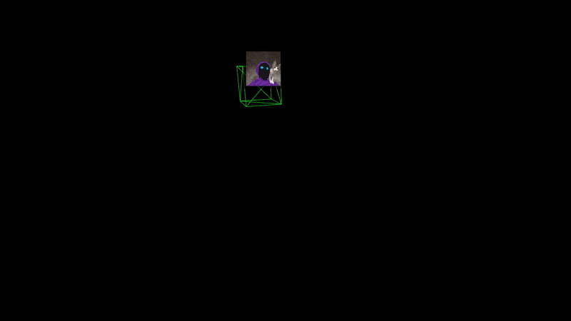

# Sorcherer


**Sorcherer** is a lightweight JavaScript library for attaching dynamic HTML overlays to Three.js Object3D instances. With Sorcherer, you can define overlays in your HTML using a custom `<realm>` tag and have them automatically update (with culling, distance‑based scaling, rotation via CSS, auto‑centering, dynamic variables, and more) based on your 3D scene’s state.

  - [Features](#features)
  - [Installation](#installation)
  - [Usage](#usage)
    - [Importing the Library](#importing-the-library)
    - [Defining Overlays via the `<realm>` Tag](#defining-overlays-via-the-realm-tag)
    - [Example](#example)
  - [API Reference](#api-reference)
    - [Static Methods](#static-methods)
    - [Instance Methods](#instance-methods)
  - [Contributing](#contributing)
  - [License](#license)


## Features

- **HTML Overlays for 3D Objects:** Attach DOM overlays to any Three.js Object3D.
- **Custom `<realm>` Tag:** Easily declare overlay elements with custom attributes.
- **Distance-Based Scaling:** Scale overlays based on the actual Euclidean distance from the camera.
- **Rotation Simulation:** Apply rotation from your Object3D via CSS’s `rotate` property. [!Currently Broken : D!]
- **Auto-Centering:** Optionally center overlays relative to their computed screen positions.
- **DOM Culling:** Efficient frustum culling to update only visible overlays.
- **Dynamic Variables:** Use placeholders in overlay content (e.g. `$dogCount=20$`) that become accessible as properties on the overlay instance.
- **Global Access & Cloning:** Access all overlays via `Sorcherer.instancesById` and clone overlays easily using the `attachClone` method.

## Installation

Install via npm:

```bash
npm install sorcherer
```

Or clone the repository directly from GitHub.

## Usage

### Importing the Library

Use Sorcherer as an ES module:

```js
import { Sorcherer } from 'sorcherer';
```

### Defining Overlays via the `<realm>` Tag

Define overlays in your HTML with a custom `<realm>` tag. Each child element must have an `idm` attribute (matching a registered Object3D's name) and can include additional attributes:

- `simulate3D="true"` – Enable distance‑based scaling.
- `simulateRotation="true"` – Enable rotation via the CSS `rotate` property.
- `offset="x,y,z"` – Set a custom offset (comma‑separated values).
- `autoCenter="true"` – Center the overlay relative to its computed screen position.
- `scaleMultiplier="1.5"` – Multiply the computed scale factor (default is given by `Sorcherer.defaultScaleMultiplier`).

Overlay content may include dynamic variable placeholders in the form `$varName$` or `$varName=defaultValue$`.

### Example

Below is a complete HTML example that creates a Three.js scene with a rotating cube, registers the cube with Sorcherer, and defines an overlay via `<realm>` that displays **osciliating_cat.gif**. It also demonstrates dynamic variables and global instance access.

```html
<!DOCTYPE html>
<html lang="en">
  <head>
    <meta charset="UTF-8" />
    <title>Sorcherer Demo – Osciliating Cat</title>
    <style>
      body {
        margin: 0;
        overflow: hidden;
        background: #222;
      }
    </style>
  </head>
  <body>
    <!-- Define overlays using the custom <realm> tag -->
    <realm>
      <!--
           Attributes:
           idm="cube"               => Matches a registered Object3D with name "cube"
           simulate3D="true"        => Enable distance-based scaling
           simulateRotation="true"  => Enable rotation via the CSS "rotate" property
           offset="0,0.5,0"         => Custom vertical offset
           autoCenter="true"        => Center the overlay relative to its computed position
           scaleMultiplier="1.5"    => Multiply the computed scale factor by 1.5
      -->
      <div idm="cube" simulate3D="true" simulateRotation="true" offset="0,0.5,0" autoCenter="true" scaleMultiplier="1.5">
        <br>
        Dog count: $dogCount=20$
      </div>
    </realm>

    <script type="module">
      import * as THREE from 'three';
      import { Sorcherer } from 'sorcherer';

      // Set up the Three.js scene, camera, and renderer.
      const scene = new THREE.Scene();
      const camera = new THREE.PerspectiveCamera(75, window.innerWidth / window.innerHeight, 0.1, 1000);
      camera.position.z = 5;

      const renderer = new THREE.WebGLRenderer({ antialias: true });
      renderer.setSize(window.innerWidth, window.innerHeight);
      document.body.appendChild(renderer.domElement);

      // Create a cube, name it "cube", and add it to the scene.
      const geometry = new THREE.BoxGeometry();
      const material = new THREE.MeshBasicMaterial({ color: 0x00ff00, wireframe: true });
      const cube = new THREE.Mesh(geometry, material);
      cube.name = "cube";
      scene.add(cube);

      // Register the cube with Sorcherer.
      Sorcherer.registerObject3D(cube);
      Sorcherer.attachFromRealm();
      Sorcherer.autoSetup(camera, renderer);

      // Demonstrate updating a dynamic variable after 3 seconds.
      setTimeout(() => {
        Sorcherer.instancesById["cube"].dogCount = "42";
      }, 3000);

      // Animate the cube: circular motion in the xz-plane and oscillation along the y-axis.
      function animate() {
        requestAnimationFrame(animate);
        const t = Date.now() * 0.001;
        cube.position.x = Math.cos(t) * 2;
        cube.position.z = Math.sin(t) * 2;
        cube.position.y = Math.sin(t * 2) * 1;
        cube.rotation.x += 0.005;
        cube.rotation.y += 0.005;
        cube.rotation.z += 0.01;
        renderer.render(scene, camera);
      }
      animate();

      window.addEventListener("resize", () => {
        camera.aspect = window.innerWidth / window.innerHeight;
        camera.updateProjectionMatrix();
        renderer.setSize(window.innerWidth, window.innerHeight);
      });
    </script>
  </body>
</html>
```

## API Reference

### Static Methods

- **`Sorcherer.registerObject3D(object)`**  
  Registers a Three.js Object3D with the library using its `name` property as the key.

- **`Sorcherer.attachFromRealm()`**  
  Scans the DOM for a `<realm>` tag and attaches overlays based on child elements’ custom attributes.

- **`Sorcherer.autoSetup(camera, renderer, interval?)`**  
  Starts the auto-update loop that refreshes overlays based on camera changes. The optional `interval` (in ms) defaults to 16.

- **`Sorcherer.defaultScaleMultiplier`**  
  A static property that defines the default multiplier for distance‑based scaling. You can adjust it as needed:
  ```js
  Sorcherer.defaultScaleMultiplier = 1.2;
  ```

- **`Sorcherer.instancesById`**  
  A global object mapping Object3D names (idm) to their overlay instances. You can access overlays directly, e.g.:
  ```js
  Sorcherer.instancesById["cube"].dogCount = "42";
  ```

### Instance Methods

- **`attach(innerHTML)`**  
  Attaches the provided HTML content to the overlay element (using `innerHTML` so that markup is parsed). This method also parses dynamic variable placeholders (e.g. `$dogCount=20$`) and creates getters/setters for direct access.

- **`bufferInstance(camera, renderer)`**  
  Updates the overlay’s position, scaling (distance‑based), rotation (via CSS `rotate`), and auto-centering based on the current camera and Object3D state. It also re-renders dynamic variables.

- **`dispose()`**  
  Removes the overlay element and cleans up references.

- **`attachClone(targetObject, newName)`**  
  Clones the current overlay instance and attaches the clone to the specified `targetObject`. The new overlay is assigned the provided `newName` and stored in `Sorcherer.instancesById` under that name.

- **Dynamic Variable Access:**  
  After calling `attach()`, any dynamic variable placeholder in the template becomes accessible directly as a property of the overlay instance. For example, if the template contains `$dogCount=20$`:
  ```js
  Sorcherer.instancesById["cube"].dogCount = "42";
  console.log(Sorcherer.instancesById["cube"].dogCount); // "42"
  ```

## Contributing

Contributions are welcome! Please open issues or submit pull requests on the [GitHub repository](https://github.com/yepistream/sorcherer).

## License

This project is licensed under the MIT License.

# Only dependency is, of course, THREEJS
